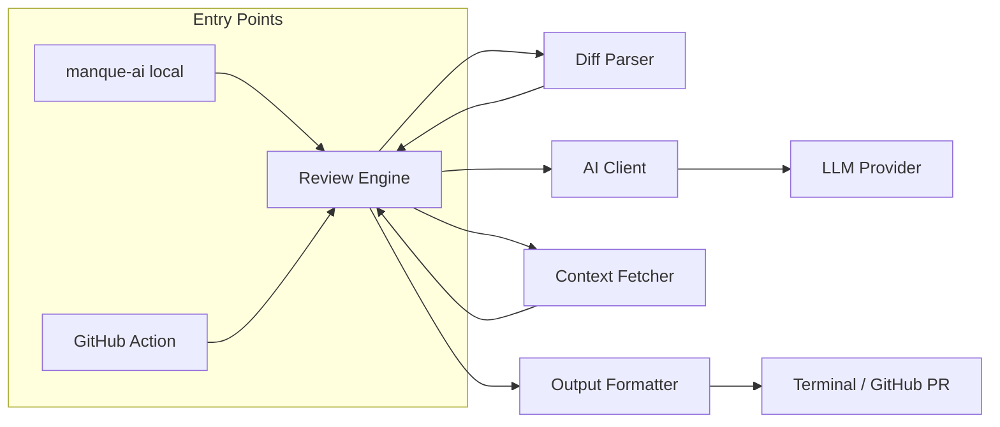
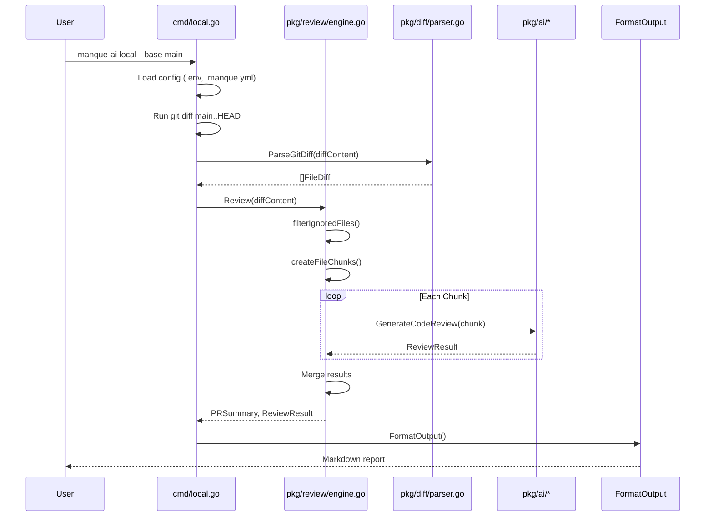
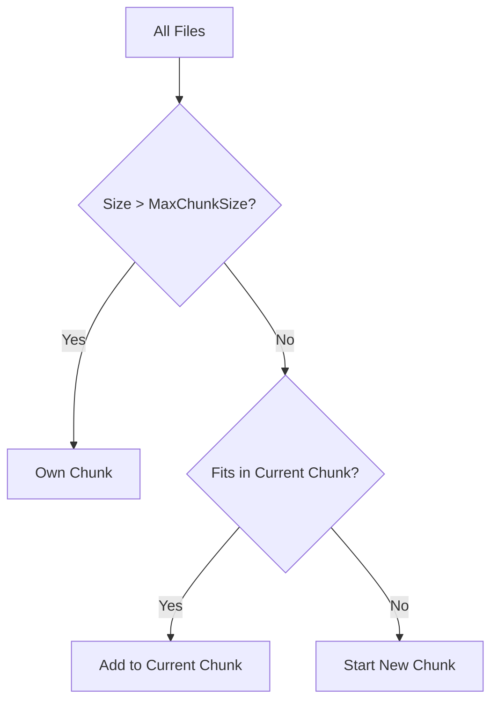

# Manque AI – Architecture Walkthrough

> **Manque AI** is an open-source, LLM-powered code reviewer for GitHub Pull Requests.
> It runs as a **GitHub Action** (CI) or as a **local CLI** (pre-push).

---

## High-Level Overview



| Layer | Purpose |
|-------|---------|
| **Entry Points** (`cmd/`) | CLI commands (`local`, `root`) |
| **Review Engine** (`pkg/review/`) | Orchestrates the review pipeline |
| **AI Client** (`pkg/ai/`) | Adapters for OpenAI, Anthropic, Google, OpenRouter |
| **Diff Parser** (`pkg/diff/`) | Parses `git diff` output into structured data |
| **Context Fetcher** (`pkg/context/`) | Retrieves `git blame` and symbol context |
| **GitHub Client** (`pkg/github/`) | Posts comments, updates PR description |
| **State** (`pkg/state/`) | Tracks sessions and deduplicates comments |

---

## Directory Structure

```
manque-ai/
├── cmd/                   # CLI Commands
│   ├── root.go            # GitHub Action / Remote PR review
│   ├── local.go           # Local pre-push review
│   └── webhook.go         # (Optional) Webhook server
├── pkg/
│   ├── review/            # Core Review Engine
│   │   ├── engine.go      # Orchestration, chunking, aggregation
│   │   └── engine_test.go
│   ├── ai/                # LLM Adapters
│   │   ├── client.go      # Factory + BaseClient
│   │   ├── openai.go      # OpenAI adapter
│   │   ├── anthropic.go   # Anthropic adapter
│   │   ├── google.go      # Google Gemini adapter
│   │   ├── openrouter.go  # OpenRouter adapter
│   │   ├── prompts.go     # System prompts
│   │   └── types.go       # PRSummary, ReviewResult, Comment
│   ├── diff/              # Git Diff Parsing
│   │   └── parser.go      # ParseGitDiff, FormatForLLM
│   ├── context/           # Git Blame & Symbol Resolution
│   │   ├── blame.go       # GetFileBlameContext
│   │   ├── fetcher.go     # ContextFetcher
│   │   └── resolver.go    # Symbol resolution
│   ├── github/            # GitHub API Client
│   │   └── client.go      # PostReviewComment, UpdatePR
│   ├── state/             # Session & Comment Tracking
│   │   ├── session.go     # Session management
│   │   └── tracker.go     # Comment deduplication
│   ├── config/            # File-based config (.manque.yml)
│   └── discovery/         # Auto-discover repo practices
├── internal/              # Shared internals
│   ├── config.go          # Environment variable loading
│   └── logger.go          # Structured logger
├── main.go                # Entry point
├── action.yml             # GitHub Action definition
└── Dockerfile             # Container image
```

---

## Data Flow

### 1. Local Review (`manque-ai local`)



### 2. GitHub Action (`manque-ai`)

The flow is similar, but instead of printing to terminal:
1. Fetches PR info via GitHub API.
2. Posts review comments and updates PR description.
3. Uses `pkg/state` to deduplicate comments across runs.

---

## Key Components

### Review Engine (`pkg/review/engine.go`)

The **Engine** is the heart of the system. It:

1. **Parses the diff** into structured `FileDiff` objects.
2. **Filters ignored files** (e.g., `package-lock.json`).
3. **Chunks large diffs** to fit within LLM context limits.
4. **Sends each chunk** to the AI client.
5. **Aggregates results** (comments, scores, security concerns).
6. **Formats output** as Markdown.

#### Chunking Strategy

Large PRs can exceed LLM context limits. The engine uses a **greedy bin-packing** algorithm:

```go
const MaxChunkSize = 80000  // ~80K characters per chunk
```

1. Calculate the size of each file's diff.
2. Sort files by size (largest first).
3. Pack files into chunks without exceeding `MaxChunkSize`.
4. Files larger than `MaxChunkSize` get their own chunk.



---

### AI Client (`pkg/ai/`)

The `ai` package provides a **unified interface** for multiple LLM providers:

```go
type Client interface {
    GeneratePRSummary(title, description, diff string) (*PRSummary, error)
    GenerateCodeReview(title, description, diff string) (*ReviewResult, error)
    GenerateCodeReviewWithStyleGuide(title, description, diff, styleGuide string) (*ReviewResult, error)
    GenerateResponse(prompt string) (string, error)
}
```

#### Supported Providers

| Provider | File | Notes |
|----------|------|-------|
| OpenAI | `openai.go` | GPT-4o, GPT-4, etc. |
| Anthropic | `anthropic.go` | Claude 3.5 Sonnet, Opus, etc. |
| Google | `google.go` | Gemini 1.5 Pro, Flash |
| OpenRouter | `openrouter.go` | Any model via OpenRouter |
| Local Ollama | via `openai.go` | Set `LLM_BASE_URL=http://localhost:11434/v1` |

#### Response Types

```go
type PRSummary struct {
    Title       string
    Description string
    Files       []FileChange  // Per-file summaries
}

type ReviewResult struct {
    Review   ReviewSummary  // Score, effort, security
    Comments []Comment      // Line-level feedback
}

type Comment struct {
    File            string
    StartLine       int
    EndLine         int
    Header          string
    Content         string
    Label           string  // "bug", "security", "style"
    Critical        bool
    HighlightedCode string
    SuggestedCode   string  // Suggested fix
}
```

---

### Diff Parser (`pkg/diff/parser.go`)

Parses raw `git diff` output into structured data:

```go
type FileDiff struct {
    Filename string
    Hunks    []Hunk
}

type Hunk struct {
    OldStart, OldCount int
    NewStart, NewCount int
    Lines    []Line
}

type Line struct {
    Type    LineType  // Added, Removed, Context
    Content string
    OldNum, NewNum int
}
```

The `FormatForLLM` function converts this into a format optimized for LLM comprehension:

```
## File: 'pkg/review/engine.go'
@@ -10,5 +10,8 @@
__new hunk__
10  func Review() {
11 +    // New code
12 +    doSomething()
__old hunk__
-    // Old code
```

---

### Context Fetcher (`pkg/context/`)

Provides **git blame** and symbol resolution to give the LLM more context:

- **blame.go**: Who last modified each line.
- **resolver.go**: Resolves symbols (function names, types) in the diff.

This helps the LLM understand "who owns this code" and "what patterns are in use."

---

### GitHub Client (`pkg/github/client.go`)

Interacts with the GitHub API for:

- Fetching PR metadata (title, description, diff).
- Posting review comments.
- Updating PR title/description with AI-generated summaries.
- Handling [discussions](file:///Users/howdy/Documents/projects/manque-ai/pkg/feedback) (emoji reactions = feedback).

---

### State Management (`pkg/state/`)

- **session.go**: Tracks review sessions to avoid re-reviewing unchanged code.
- **tracker.go**: Deduplicates comments using content fingerprinting.

This prevents the bot from posting the same comment multiple times across incremental reviews.

---

## Configuration

### Environment Variables

| Variable | Description | Required |
|----------|-------------|----------|
| `LLM_PROVIDER` | `openai`, `anthropic`, `google`, `openrouter` | Yes |
| `LLM_API_KEY` | API key for the provider | Yes |
| `LLM_MODEL` | Model ID (e.g., `gpt-4o`) | No |
| `GH_TOKEN` | GitHub token (for Action) | Action only |
| `STYLE_GUIDE_RULES` | Custom rules for the AI | No |

### File-based Config (`.manque.yml`)

```yaml
review:
  auto_approve_threshold: 90
  block_on_critical: true

ignore:
  - "*.lock"
  - "vendor/**"

rules:
  - path: "internal/payments/**"
    severity_override: "high"
    extra_rules: "Always check for SQL injection"
```

---

## Output Format

The `FormatOutput` function generates a Markdown report:

```markdown
🐰 **Executive Summary**
> This PR adds chunking support for large diffs...

---

### 📝 File: `pkg/review/engine.go`
**Line**: 75 to 80  
**Type**: `suggestion`

**Comment:**
🟡 Consider extracting this into a separate function.

**Current Code:**
```go
for _, file := range files {
    // ...
}
```

**Suggested Fix:**
```suggestion
func processFiles(files []FileDiff) { ... }
```

**Prompt for AI Agent:**
> Extract the loop into a `processFiles` helper function.
```

---

## Testing

```bash
# Run all tests
go test ./...

# Run with verbose output
go test -v ./pkg/review/...

# Mock mode (no LLM calls)
manque-ai local --mock
```

---

## Future Improvements

See [ROADMAP.md](file:///Users/howdy/Documents/projects/manque-ai/ROADMAP.md) for planned features.
